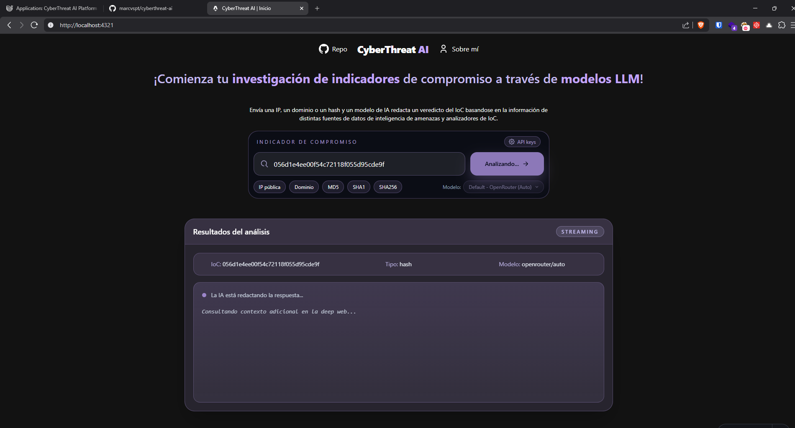
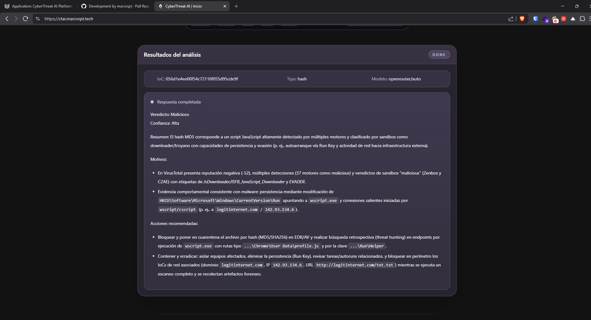
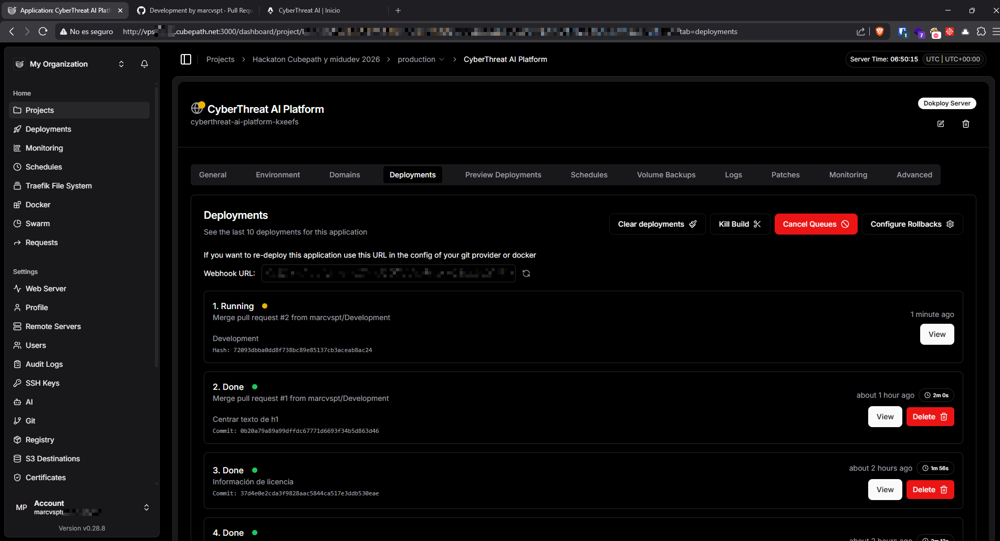

# CyberThreat AI

> Proyecto creado para la [Hackaton Midudev + CubePath 2026](https://github.com/midudev/hackaton-cubepath-2026), lee mi propuesta en la [Issue #178](https://github.com/midudev/hackaton-cubepath-2026/issues/178). Puedes probar el proyecto en [https://ctai.marcvspt.tech](https://ctai.marcvspt.tech).

CyberThreat AI analiza indicadores de compromiso (IoC) usando múltiples fuentes de threat intelligence (VirusTotal, AbuseIPDB, PolySwarm y Robtex), y después consulta una IA vía OpenRouter para entregar un veredicto razonado en español.




***Use un VPS con Dokploy para el despliegue de esta plataforma CyberThreat AI. Desde que conozco Dokploy lo he querido probar más haya de una PoC simple por hobbie, y este Hakaton me dio la oportunidad de usarlo y jugar con esta herramienta***



## TODO

- [x] Endpoint para envío de IoCs
- [x] Formulario de envío de IoCs
- [x] Espacio para respuesta
- [x] Detección de tipo de IoC con validadores Zod (IPv4, IPv6, dominio, MD5, SHA1, SHA256)
- [x] Conexión con API de [VirusTotal](https://virustotal.com)
- [x] Conexión con API de [AbuseIPDB](https://abuseipdb.com)
- [x] Conexión con API de [PolySwarm](https://polyswarm.network)
- [x] Conexión con API de [Robtex](https://robtex.com)
- [x] Conexión con API de [OpenRouter](https://openrouter.ai)
- [x] Normalización de información
- [x] Stream de datos de la respuesta de la IA
- [x] Despliegue de la plataforma
- [x] Rate limit de consultas a la API
- [x] Colocar API keys propias de los usuarios para las herramientas utilizadas
- [x] Permitir a los usuarios usar varios modelos de IA
- [x] Sistema de advertencias por fuente (API key inválida, sin datos)
- [x] Errores específicos de OpenRouter (API key inválida, error de modelo, servicio no disponible)

## Características actuales

- Endpoint único de análisis en `/api/ctai`.
- Orquestación modular del endpoint en `src/scripts/core/ctai.ts` (rate limit, resolución de IoC/modelo, stream SSE y ejecución por tipo).
- Detección de tipo de IoC con **Zod** (`z.ipv4`, `z.ipv6`, `z.hostname`, `z.hash`) centralizada en `src/scripts/core/iocValidators.ts`.
- El campo **Tipo** en la UI muestra el subtipo exacto: `IPv4`, `IPv6`, `domain`, `hash/md5`, `hash/sha1`, `hash/sha256`.
- Arquitectura de proveedores CTI separada en `src/scripts/sources/` (VirusTotal, AbuseIPDB, Robtex, PolySwarm), agnóstica al tipo de IoC.
- Sistema de **advertencias por fuente**: si una API falla con clave inválida o sin datos, el análisis continúa con las demás fuentes y se informa en la UI sin cortar el flujo.
- Streaming en tiempo real de la respuesta de IA (SSE).
- El modelo mostrado en UI corresponde al **modelo ruteado real** por `OpenRouter` (cuando está disponible).
- Render de markdown en la UI con `Streamdown` durante el streaming de la respuesta de IA.
- Rate limit por IP en `/api/ctai` (configurable por variables de entorno).
- Selector de modelo de IA desde UI (lista permitida en `src/scripts/catalog/models.ts`).
- Modal para configurar API keys del usuario (persistidas en localStorage).
- Fallback automático a variables de entorno si no se envían keys por cabecera.

## Desplegar para desarrollo

1. Instala dependencias:

```sh
pnpm install
```

2. Crea un archivo `.env` con las keys (opcionales, recomendadas para fallback backend):

```env
VIRUSTOTAL_API_KEY=your-virustotal-apikey
ABUSEIPDB_API_KEY=your-abuseipdb-apikey
POLYSWARM_API_KEY=your-polyswarm-apikey
OPENROUTER_API_KEY=your-openrouter-apikey
RATE_LIMIT_POINTS=5
RATE_LIMIT_DURATION=60
```

> Robtex ofrece API pública sin API key para el flujo actual.

3. Inicia el servidor de desarrollo:

```sh
pnpm run dev #http://localhost:4321
```

## API

### 1) Health

- Ruta: `/api/health`
- Método: `GET`
- Respuesta:

```json
{
  "status": "ok"
}
```

### 2) Análisis IoC + IA en stream

- Ruta: `/api/ctai?ioc=<valor>&model=<modelo>`
- Método: `GET`
- Query params:
  - `ioc` (requerido): indicador IPv4, IPv6, dominio, MD5, SHA1 o SHA256.
  - `model` (opcional): modelo permitido; si no es válido se usa el default.

- Headers opcionales para keys de usuario:
  - `X-OpenRouter-Key`
  - `X-VT-Key`
  - `X-AbuseIPDB-Key`
  - `X-Polyswarm-Key`

- Content-Type de salida: `text/event-stream`

- Eventos SSE emitidos:

| Evento  | Payload                                  | Descripción                                       |
|---------|------------------------------------------|---------------------------------------------------|
| `meta`  | `{ ioc, type, model, warnings? }`        | Metadatos iniciales; `warnings` si hay fuentes con advertencia |
| `model` | `{ model }`                              | Modelo ruteado real por OpenRouter                |
| `chunk` | `{ content }`                            | Fragmento de texto de la respuesta IA             |
| `done`  | `{ done: true }`                         | Fin del stream                                    |
| `error` | `{ error, stage, errorType }`            | Error durante el stream                           |

- `errorType` puede ser: `invalid_api_key`, `model_error`, `api_unavailable`, `not_found`, `unknown`.

Ejemplo:

```bash
curl "http://localhost:4321/api/ctai?ioc=1.2.3.4&model=openrouter/auto"
curl "http://localhost:4321/api/ctai?ioc=2001:4860:4860::8888"
curl "http://localhost:4321/api/ctai?ioc=44d88612fea8a8f36de82e1278abb02f"
```

Comportamiento de errores:

- Si **todas** las fuentes CTI fallan críticamente, se corta el flujo y no se invoca OpenRouter.
- Si **algunas** fuentes fallan, el análisis continúa con las disponibles y se emiten advertencias en `meta.warnings`.
- Los errores de OpenRouter son específicos: clave inválida, error del modelo (p. ej. límite de contexto) o servicio no disponible.

Errores comunes (JSON):

```json
{ "error": "Falta el parámetro de IoC" }
```

```json
{ "error": "Tipo de IoC desconocido" }
```

```json
{ "error": "No se pudo completar la consulta de fuentes del IoC.", "stage": "ioc", "errorType": "unknown" }
```

```json
{ "error": "La API Key de OpenRouter no es válida o no tiene permisos suficientes.", "stage": "ai", "errorType": "invalid_api_key" }
```

```json
{ "error": "Too many requests", "retryAfterSeconds": 12 }
```

## Modelos permitidos

La fuente única de modelos está en `src/scripts/catalog/models.ts` (`AVAILABLE_MODELS`).

Modelos actualmente permitidos:

- `openrouter/auto`
- `openrouter/free`
- `liquid/lfm-2.5-1.2b-instruct-20260120:free`
- `stepfun/step-3.5-flash:free`
- `google/gemma-3-4b-it:free`

## Estructura del proyecto

```text
src/
├── assets/
├── components/
│   ├── AIResponsePanel.tsx
│   ├── AlertBox.tsx
│   ├── ApiKeysModal.tsx
│   ├── ApiKeysSettingsButton.tsx
│   ├── App.tsx
│   ├── Footer.astro
│   ├── Header.astro
│   ├── IoCInputField.tsx
│   ├── IoCSearchForm.tsx
│   ├── IocTypeChips.tsx
│   └── ModelSelector.tsx
├── hooks/
│   ├── useAnalyzeIoC.ts
│   ├── useApiKeys.ts
│   └── useClickOutside.ts
├── layouts/
│   └── BaseLayout.astro
├── pages/
│   ├── index.astro
│   └── api/
│       ├── ctai.ts
│       └── health.ts
├── scripts/
│   ├── core/
│   │   ├── ctai.ts
│   │   ├── ctaiClient.ts
│   │   ├── errors.ts
│   │   └── iocValidators.ts
│   ├── catalog/
│   │   ├── data.ts
│   │   ├── models.ts
│   │   ├── statusMessages.ts
│   │   └── utils.ts
│   ├── iocs/
│   │   ├── domain.ts
│   │   ├── fetcher.ts
│   │   ├── hash.ts
│   │   └── ip.ts
│   ├── sources/
│   │   ├── abuseipdb.ts
│   │   ├── polyswarm.ts
│   │   ├── robtex.ts
│   │   └── virustotal.ts
│   └── types.ts
└── styles/
    └── global.css
```

## Roadmap

- [ ] Implementar test
- [ ] Refactorizar y simplificar código
- [ ] Documentar la API y todo lo que puede devolver
- [ ] Enviar multiples IoCs en la misma consulta separandolos por coma, punto y coma, y/o salto de linea.
- [ ] Enviar IoCs por lotes usando archivos **CSV** o dividos por salto
- [x] Implementar `zod` para validación de datos
- [x] Arquitectura modular por proveedor CTI (`sources/`)
- [ ] Creación de cuentas de usuarios
- [ ] Guardar historial de busquedas y respuestas
- [ ] Cache de respuestas de las APIs y de las IAs para IoCs recientes
- [ ] Implementar más herramientas de información sobre IoCs

## Stack

- [CubePath](https://cubepath.com)
- [Astro](https://astro.build/)
- [React](https://react.dev/)
- [Tailwind CSS](https://tailwindcss.com/)
- [Tabler Icons](https://tabler.io/icons)
- [SVGl](https://svgl.app/)
- [Heroicons](https://heroicons.com/)
- [TypeScript](https://www.typescriptlang.org/)
- [Streamdown](https://streamdown.ai/)
- [Zod](https://zod.dev/)
- [OpenRouter](https://openrouter.ai/)
- [VirusTotal](https://www.virustotal.com/)
- [AbuseIPDB](https://www.abuseipdb.com/)
- [PolySwarm](https://polyswarm.io/)
- [Robtex](https://www.robtex.com/)
- [GitHub Copilot](https://github.com/copilot/)

## Licencia

Este proyecto está licenciado bajo los términos de la [GNU General Public License v3.0](https://github.com/marcvspt/cyberthreat-ai/blob/master/LICENSE).
