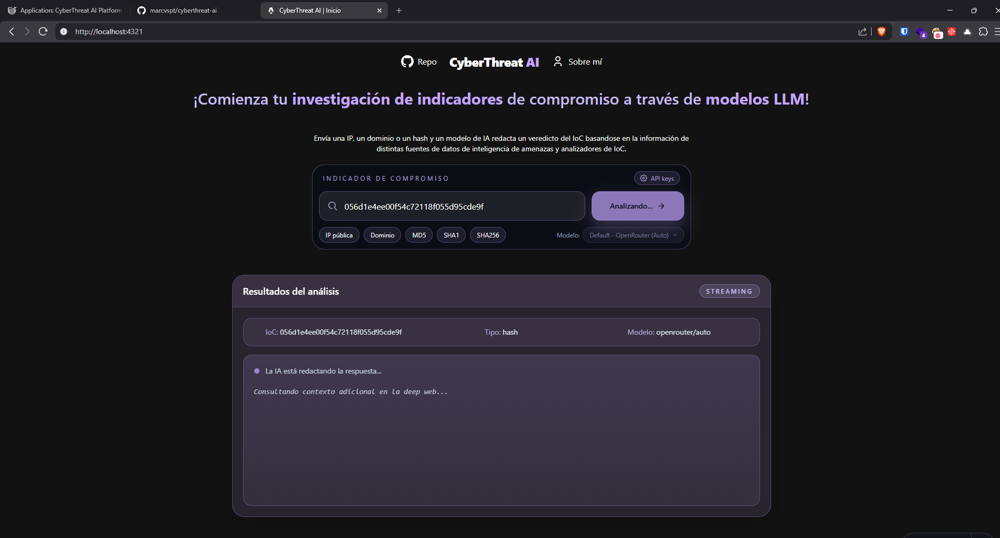
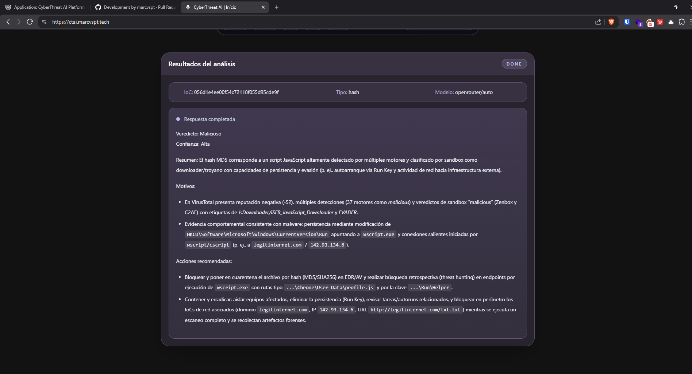
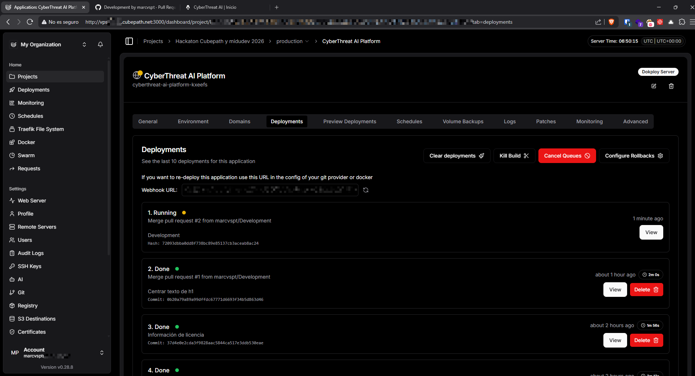

# CyberThreat AI

> Proyecto creado para la [Hackaton Midudev + CubePath 2026](https://github.com/midudev/hackaton-cubepath-2026), lee mi propuesta en la [Issue #178](https://github.com/midudev/hackaton-cubepath-2026/issues/178). Puedes probar el proyecto en [https://ctai.marcvspt.tech](https://ctai.marcvspt.tech).

Analiza indicadores de compromiso (IoC) con múltiples fuentes de inteligencia de amenazas y obtiene un veredicto razonado en español mediante modelos de IA a través de OpenRouter.

**[Probar la aplicación](https://ctai.marcvspt.tech)**

## Qué puedes hacer

- Consultar un IoC por análisis: IPv4, IPv6, dominio, MD5, SHA1 o SHA256.
- Combinar información de VirusTotal, AbuseIPDB, Robtex y PolySwarm según el tipo de indicador.
- Recibir la respuesta de IA en tiempo real mediante Server-Sent Events (SSE), con Markdown renderizado por Streamdown.
- Seleccionar un modelo y ver el modelo que OpenRouter ha utilizado realmente, cuando lo informa.
- Configurar claves propias desde la interfaz, con fallback a las claves del servidor.
- Consultar advertencias por fuente cuando una consulta falla o no encuentra datos.

| Indicador | Fuentes consultadas | Tipo mostrado en la UI |
| --- | --- | --- |
| IPv4 / IPv6 | VirusTotal, AbuseIPDB | `IPv4`, `IPv6` |
| Dominio | VirusTotal, Robtex | `domain` |
| MD5 / SHA1 / SHA256 | VirusTotal, PolySwarm | `hash/md5`, `hash/sha1`, `hash/sha256` |

## Capturas





## Desarrollo local

### Requisitos

- Node.js **22 o superior**.
- `pnpm` disponible en el entorno.
- Claves de los proveedores que quieras utilizar. Robtex no requiere clave en el flujo actual.

### Instalación y configuración

1. Instala las dependencias desde la raíz del repositorio:

   ```sh
   pnpm install
   ```

2. Crea un archivo `.env` en la raíz y sustituye los valores de ejemplo:

   ```env
   VIRUSTOTAL_API_KEY=your-virustotal-apikey
   ABUSEIPDB_API_KEY=your-abuseipdb-apikey
   POLYSWARM_API_KEY=your-polyswarm-apikey
   OPENROUTER_API_KEY=your-openrouter-apikey
   RATE_LIMIT_POINTS=5
   RATE_LIMIT_DURATION=60
   ```

   Las seis variables están declaradas como obligatorias en `env.schema`, dentro de `astro.config.mjs`, mediante `envField`. El backend las importa desde `astro:env/server`. Las claves enviadas por el usuario tienen prioridad sobre las del servidor; configurar claves en la UI no elimina los requisitos del esquema de entorno.

3. Inicia el servidor:

   ```sh
   pnpm run dev
   ```

   Abre [localhost:4321](http://localhost:4321).

### Comandos

| Comando | Propósito |
| --- | --- |
| `pnpm install` | Instalar las dependencias |
| `pnpm run dev` | Iniciar el servidor de desarrollo |
| `pnpm run build` | Compilar con el adaptador configurado y generar el sitemap |
| `pnpm run preview` | Ejecutar el comando de preview de Astro para la configuración actual |
| `pnpm exec astro` | Acceder a la CLI de Astro |

Actualmente no hay scripts de test, lint ni check configurados. La compilación no sustituye esas comprobaciones.

## Configuración y persistencia

### Claves de API

El modal de configuración permite guardar claves de OpenRouter, VirusTotal, AbuseIPDB y PolySwarm. Se almacenan en el navegador bajo `ctai_api_keys` y se envían al backend mediante cabeceras durante el análisis. Son accesibles al JavaScript del mismo origen; tenlo en cuenta al usar un equipo compartido.

Las claves del servidor permanecen en variables de entorno. No incluyas valores reales en archivos versionados, capturas ni registros. `.env` y `.env.production` están excluidos mediante `.gitignore`.

### Modelos

`src/scripts/catalog/models.ts` centraliza la lista (`AVAILABLE_MODELS`), el valor por defecto (`DEFAULT_MODEL`) y la validación (`isAllowedModel`) para la UI y el servidor.

| ID permitido | Uso |
| --- | --- |
| `openrouter/auto` | Modelo por defecto |
| `openrouter/free` | Selección de modelos gratuitos de OpenRouter |
| `poolside/laguna-xs-2.1:free` | Modelo seleccionable |
| `inclusionai/ling-3.0-flash:free` | Modelo seleccionable |

Si `model` no se envía o no está permitido, el servidor utiliza `openrouter/auto`. Esta tabla refleja la lista configurada en el proyecto, no una garantía de disponibilidad del proveedor.

La selección se guarda bajo `ctai:selected-model` y se recupera después del montaje para mantener coherente la hidratación SSR. Si el valor guardado no está permitido o falla la lectura, se conserva el default. Si falla la escritura, la selección sigue disponible en memoria durante la sesión del componente.

### Rate limit

`/api/ctai` usa `RateLimiterMemory` de `rate-limiter-flexible`, configurado en `src/pages/api/ctai.ts`:

| Variable | Significado | Valor de ejemplo |
| --- | --- | --- |
| `RATE_LIMIT_POINTS` | Solicitudes permitidas por IP durante la ventana | `5` |
| `RATE_LIMIT_DURATION` | Duración de la ventana en segundos | `60` |

El contador se consume antes de validar el IoC, por lo que las solicitudes inválidas también cuentan. El estado reside en memoria de cada proceso: se reinicia con el proceso y no se comparte entre instancias.

La IP se obtiene, en este orden, de `cf-connecting-ip`, `x-forwarded-for` o `x-real-ip`; si ninguna está presente se usa `unknown`. La configuración del proxy debe proporcionar cabeceras fiables para que el límite represente a cada cliente.

## API

### Estado del servicio

```http
GET /api/health
```

Devuelve `200` y `Content-Type: application/json`:

```json
{ "status": "ok" }
```

Este endpoint confirma que la ruta responde; no comprueba las claves ni la disponibilidad de los proveedores externos.

### Analizar un indicador

```http
GET /api/ctai?ioc=<indicador>&model=<modelo>
```

| Parámetro | Obligatorio | Descripción |
| --- | --- | --- |
| `ioc` | Sí | IPv4, IPv6, dominio, MD5, SHA1 o SHA256 |
| `model` | No | ID permitido; usa el default si falta o no es válido |

Puedes enviar claves propias mediante estas cabeceras opcionales:

| Cabecera | Proveedor |
| --- | --- |
| `X-OpenRouter-Key` | OpenRouter |
| `X-VT-Key` | VirusTotal |
| `X-AbuseIPDB-Key` | AbuseIPDB |
| `X-Polyswarm-Key` | PolySwarm |

Ejemplos con `curl` (`curl.exe` en PowerShell si `curl` es un alias):

```sh
curl -N --get "http://localhost:4321/api/ctai" --data-urlencode "ioc=1.2.3.4" --data-urlencode "model=openrouter/auto"
curl -N --get "http://localhost:4321/api/ctai" --data-urlencode "ioc=2001:4860:4860::8888"
curl -N --get "http://localhost:4321/api/ctai" --data-urlencode "ioc=44d88612fea8a8f36de82e1278abb02f"
```

`-N` evita el buffering de salida para mostrar los eventos a medida que llegan.

### Eventos del stream

Una respuesta de análisis correcta usa `200` y `Content-Type: text/event-stream`.

| Evento | Payload | Significado |
| --- | --- | --- |
| `meta` | `{ ioc, type, model, warnings? }` | Indicador, subtipo, modelo solicitado y advertencias |
| `model` | `{ model }` | Modelo real informado por OpenRouter |
| `chunk` | `{ content }` | Fragmento de la respuesta de IA |
| `done` | `{ done: true }` | Fin del análisis |
| `error` | `{ error, stage, errorType? }` | Error después de iniciar el stream |

Cada advertencia tiene `{ source, message, reason? }`. `stage` identifica la etapa (`ioc`, `ai` o `unknown`); `errorType`, cuando está presente, puede ser `invalid_api_key`, `model_error`, `api_unavailable`, `not_found` o `unknown`.

Ejemplo de un evento:

```text
event: chunk
data: {"content":"**Veredicto:** Sospechoso"}

```

Las fuentes se consultan en paralelo. Si alguna devuelve datos, el análisis continúa y comunica las advertencias de las demás. Si todas fallan y hay un error crítico reconocido de proveedor, se devuelve un error antes de invocar OpenRouter. Si todas indican ausencia de datos, se emiten `meta` y `done` sin consultar la IA ni generar texto de análisis.

### Errores HTTP

Los errores anteriores al inicio del stream usan JSON. Un error durante el stream se comunica mediante el evento `error`; el estado HTTP ya es `200`.

| Estado | Situación | Respuesta de ejemplo |
| --- | --- | --- |
| `400` | Falta el indicador | `{ "error": "Falta el parámetro de IoC" }` |
| `400` | Indicador no válido | `{ "error": "Tipo de IoC desconocido" }` |
| `429` | Límite de solicitudes superado | `{ "error": "Too many requests", "retryAfterSeconds": 12 }` |
| `500` | Error de proveedores o de IA antes del stream | `{ "error": "…", "stage": "ioc", "errorType": "api_unavailable" }` |

Las respuestas `429` incluyen `Retry-After`, `X-RateLimit-Limit` y `X-RateLimit-Window`. Los errores de IA pueden indicar clave inválida, servicio no disponible o un error de modelo comunicado durante el streaming.

## Arquitectura

Astro sirve la estructura del sitio y los endpoints. La página principal hidrata `App.tsx` con `client:load`; React gestiona el formulario, las claves, la selección de modelo y la respuesta.

```text
Formulario React
    → GET /api/ctai: rate limit y validación del IoC/modelo
    → Análisis por tipo: consultas paralelas a proveedores CTI
    → OpenRouter: generación del veredicto en español
    → SSE: metadatos, advertencias y respuesta progresiva en la UI
```

| Ruta | Responsabilidad |
| --- | --- |
| `src/components/` | Interfaz React y componentes Astro |
| `src/hooks/` | Análisis, claves, modelo persistido y eventos de UI |
| `src/layouts/BaseLayout.astro` | Layout, metadatos y canonical |
| `src/pages/api/ctai.ts` | Endpoint de análisis y rate limit |
| `src/pages/api/health.ts` | Endpoint de estado |
| `src/pages/robots.txt.ts` | Reglas de rastreo y enlace al sitemap |
| `src/scripts/core/ctai.ts` | Orquestación del análisis y producción de SSE |
| `src/scripts/core/ctaiClient.ts` | Helpers del cliente para SSE, cabeceras y errores |
| `src/scripts/core/iocValidators.ts` | Validación de indicadores con Zod |
| `src/scripts/core/errors.ts` | Errores de proveedores y mensajes para el cliente |
| `src/scripts/iocs/` | Análisis de IP, dominio y hash; ejecución de fuentes |
| `src/scripts/sources/` | Integraciones con proveedores CTI |
| `src/scripts/catalog/` | Modelos, datos del sitio y mensajes de estado |
| `src/scripts/types.ts` | Tipos compartidos |
| `src/styles/global.css` | Estilos globales y configuración de tema |

Los imports internos usan los alias `@/pages/*`, `@/layouts/*`, `@/components/*`, `@/assets/*`, `@/styles/*`, `@/scripts/*` y `@/hooks/*`, configurados en `tsconfig.json`. Las instrucciones para agentes están en [AGENTS.md](AGENTS.md).

## Stack

| Tecnología | Función |
| --- | --- |
| Astro + `@astrojs/react` | Sitio, SSR, endpoints e integración con React |
| React + TypeScript | Interfaz interactiva y tipos |
| Tailwind CSS 4 + `@tailwindcss/vite` | Estilos |
| Zod, importado desde `astro/zod` | Validación de IoCs |
| Streamdown | Renderizado de Markdown durante el streaming |
| `rate-limiter-flexible` | Límite de consultas por IP |
| `@astrojs/sitemap` | Generación del sitemap |
| `@astrojs/netlify` | Adaptador configurado para el build |
| OpenRouter | Acceso a modelos de IA |
| VirusTotal, AbuseIPDB, PolySwarm y Robtex | Inteligencia de amenazas |

Las versiones exactas y los requisitos de Node.js están en `package.json`; las dependencias resueltas están en `pnpm-lock.yaml`.

Recursos visuales: [Tabler Icons](https://tabler.io/icons), [Heroicons](https://heroicons.com/) y [SVGl](https://svgl.app/). Herramienta de apoyo al desarrollo: [GitHub Copilot](https://github.com/copilot/).

## Despliegue

El proyecto se desplegó en un VPS de [CubePath](https://cubepath.com) gestionado con Dokploy. El hackathon fue una oportunidad para probar esta herramienta más allá de una prueba de concepto personal.



La configuración actual de `astro.config.mjs` utiliza `output: 'server'` y `@astrojs/netlify`. El adaptador determina los artefactos del build; la referencia al VPS describe el despliegue realizado. Antes de reproducirlo en otro entorno, alinea el adaptador y el runtime con el destino: este repositorio no incluye un Dockerfile ni una receta completa de despliegue en Dokploy.

Configura las variables de entorno en el destino y conserva el soporte para streaming SSE en el proxy. Revisa también cómo se propaga la IP del cliente y si habrá varias instancias, ya que el rate limit actual no comparte estado.

## Sitemap y robots.txt

`@astrojs/sitemap` está registrado como `sitemap()` en `astro.config.mjs`. La opción `site` define `https://ctai.marcvspt.tech` como base de las URLs absolutas.

| Ruta pública | Contenido |
| --- | --- |
| `/sitemap-index.xml` | Índice generado durante el build |
| `/sitemap-0.xml` | Sitemap de páginas con la configuración actual |
| `/robots.txt` | Permite el rastreo y anuncia la URL absoluta del índice |

El sitemap incluye la página de inicio (`/`); los endpoints `/api/ctai`, `/api/health` y `/robots.txt` no se incluyen. `BaseLayout.astro` enlaza el índice con `<link rel="sitemap" href="/sitemap-index.xml" />`.

Para comprobar la generación, ejecuta `pnpm run build` y revisa ambos XML en `dist/`. El servidor de desarrollo no genera estos archivos. Después del despliegue, comprueba las tres rutas públicas.

Si cambia el dominio, actualiza `site` en `astro.config.mjs`, `SITE_DATA.url` en `src/scripts/catalog/data.ts` y el referer de OpenRouter en `src/scripts/core/ctai.ts`.

## Roadmap

- [ ] Añadir tests para validadores, errores y streaming.
- [ ] Validar y normalizar las respuestas de los proveedores externos.
- [ ] Incorporar cancelación y timeouts a las consultas.
- [ ] Ampliar la documentación con ejemplos de respuesta de cada proveedor.
- [ ] Analizar varios IoCs separados por comas, punto y coma o saltos de línea.
- [ ] Importar lotes de indicadores desde CSV.
- [ ] Añadir cuentas de usuario e historial de búsquedas y respuestas.
- [ ] Incorporar caché de consultas y análisis recientes.
- [ ] Integrar más fuentes de inteligencia de amenazas.

## Licencia

Distribuido bajo [GNU General Public License v3.0](LICENSE) (`GPL-3.0-only`).
